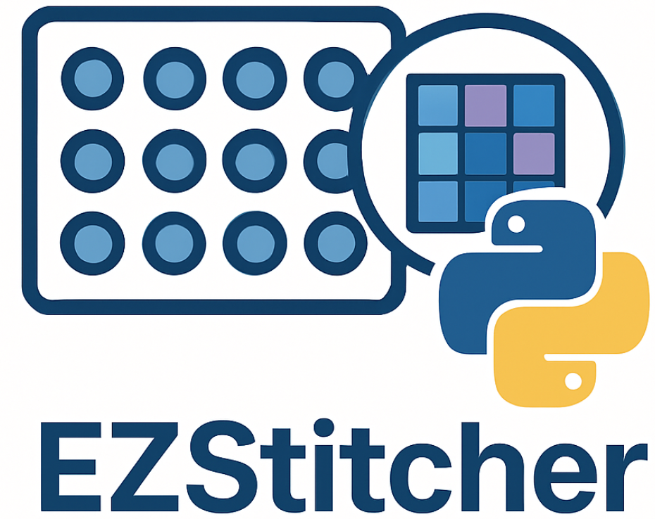

Welcome to EZStitcher's Documentation
=====================================

EZStitcher is a Python package for stitching microscopy images with support for Z-stacks, multi-channel fluorescence, and advanced focus detection.

Getting Started Quickly
--------------------

The fastest way to get started with EZStitcher is to use the ``AutoPipelineFactory``:

.. code-block:: python

    from ezstitcher.core import AutoPipelineFactory
    from ezstitcher.core.pipeline_orchestrator import PipelineOrchestrator

    # Create orchestrator and factory
    orchestrator = PipelineOrchestrator(plate_path="path/to/microscopy/data")
    factory = AutoPipelineFactory(input_dir=orchestrator.workspace_path)

    # Create and run pipelines
    pipelines = factory.create_pipelines()
    orchestrator.run(pipelines=pipelines)

For a complete quick start guide, see :doc:`getting_started/quick_start`.

Key Features
------------

- **Pipeline Factory**: Create complete stitching workflows with minimal code
- **Multi-channel fluorescence support**: Process and stitch multiple fluorescence channels
- **Z-stack handling**: Process 3D image stacks with various projection methods
- **Advanced focus detection**: Find the best focused plane in Z-stacks
- **Flexible preprocessing**: Apply custom preprocessing to images
- **Multiple microscope support**: Works with ImageXpress and Opera Phenix microscopes
- **Automatic detection**: Automatically detect microscope type and image organization
- **Object-oriented API**: Clean, modular design for easy customization

Key Resources
-----------

* :doc:`getting_started/quick_start` - Get started in minutes with a minimal example
* :doc:`user_guide/introduction` - Learn about ezstitcher's architecture and concepts
* :doc:`user_guide/basic_usage` - Explore detailed examples and common use cases
* :doc:`concepts/pipeline_factory` - Learn about the AutoPipelineFactory concept

.. toctree::
   :maxdepth: 2
   :caption: Getting Started

   getting_started/quick_start
   getting_started/installation

.. toctree::
   :maxdepth: 2
   :caption: User Guide

   user_guide/introduction
   user_guide/basic_usage
   user_guide/intermediate_usage
   user_guide/advanced_usage
   user_guide/best_practices
   user_guide/integration

.. toctree::
   :maxdepth: 2
   :caption: Core Concepts

   concepts/pipeline_factory
   concepts/architecture_overview
   concepts/pipeline
   concepts/specialized_steps
   concepts/function_handling
   concepts/directory_resolution

.. toctree::
   :maxdepth: 2
   :caption: API Reference

   api/index

.. toctree::
   :maxdepth: 2
   :caption: Development

   development/index

.. toctree::
   :maxdepth: 2
   :caption: Appendices

   appendices/index

Indices and tables
==================

* :ref:`genindex`
* :ref:`modindex`
* :ref:`search`
