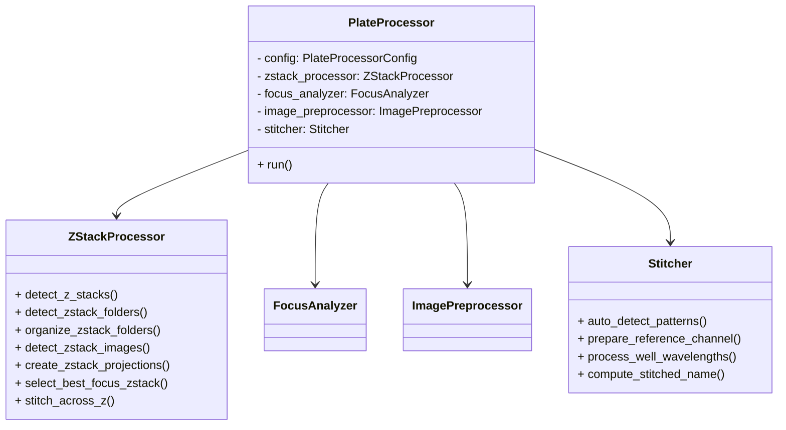

# Architecture Review of ezstitcher Refactoring

```
Status: Complete
Progress: 100%
Last Updated: 2023-04-09
Dependencies: []
```

## Overview

The codebase has undergone a significant migration from static utility methods to an **instance-based, object-oriented design** centered around `PlateProcessor`, `ZStackProcessor`, `Stitcher`, and related components.

---

## Strengths

### 1. Migration to Instance-Based Design
- Transition away from static methods (`StitcherManager`, `ZStackManager`) to instance methods.
- Promotes **encapsulation**, **testability**, and **extensibility**.
- Enables **dependency injection** via configuration objects.

### 2. Clear Separation of Concerns
- `PlateProcessor` orchestrates the entire workflow.
- `ZStackProcessor` handles Z-stack detection, organization, projections, and stitching.
- `FocusAnalyzer`, `ImagePreprocessor`, and `Stitcher` encapsulate their respective domains.
- Modular design facilitates maintenance and feature additions.

### 3. Comprehensive Workflow in `PlateProcessor.run()`
- Replaces the monolithic static method.
- Handles directory setup, Z-stack handling, projections, best focus, and stitching in a **structured, readable** manner.
- Uses instance attributes instead of static calls.

### 4. Improved Logging and Error Handling
- Detailed logging, including debug logs in critical methods.
- Exceptions are caught and logged with tracebacks, aiding debugging.

---

## Areas for Further Improvement

### 1. Configuration Management
- Many parameters with defaults in `run()`.
- Consider **moving all parameters into `PlateProcessorConfig`** or a dedicated `RunConfig`.
- Simplifies method signature and centralizes configuration.

### 2. Reduce Coupling to File System Structure
- Assumes specific directory layout (`TimePoint_1`, etc.).
- Abstracting file system interactions would improve portability and testability.

### 3. Replace Remaining Static Method Calls
- Some static methods like `ensure_directory` remain.
- Wrapping these in instance methods or utility classes would complete the migration.

### 4. Unit Testing of Components
- Current tests are mostly **integration tests**.
- Adding **unit tests** for individual components would improve confidence.

### 5. Asynchronous or Parallel Processing
- For large datasets, consider **parallelism** (e.g., per well or per wavelength).
- Could significantly speed up processing.

### 6. Documentation and Type Annotations
- Add **full type annotations** throughout.
- Consider generating API docs.

---

## Summary Diagram



---

## Final Thoughts

The refactoring significantly improves the code's structure and maintainability, positioning it well for future enhancements. Completing the migration, improving configuration management, and adding more granular tests would be the next logical steps.