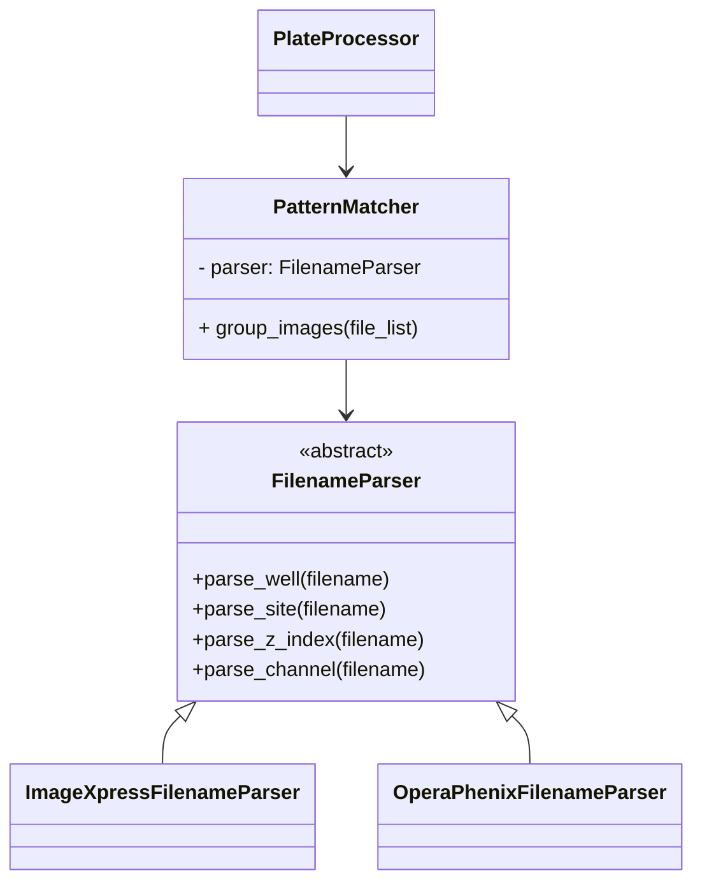

# Detailed Plan for Modular Support of OperaPhenix and Other Microscopes

---

## Context

- Current support is tailored to ImageXpress filename conventions.
- OperaPhenix uses a different, more complex naming scheme.
- Future microscopes may introduce further variations.
- The goal is **elegant, modular, extensible support** for multiple formats.

---

## High-Level Strategy

1. **Abstract filename parsing** behind a common interface.
2. **Modularize pattern matching and metadata extraction**.
3. **Configure or auto-detect** the appropriate parser.
4. **Refactor pipeline** to use metadata, not filename assumptions.
5. **Enable easy addition** of new microscope formats.

---

## Step 1: Abstract Filename Parsing

### Design

- Create an **abstract base class** `FilenameParser`:

```python
from abc import ABC, abstractmethod

class FilenameParser(ABC):
    @abstractmethod
    def parse_well(self, filename: str) -> str: ...
    @abstractmethod
    def parse_site(self, filename: str) -> int: ...
    @abstractmethod
    def parse_z_index(self, filename: str) -> int: ...
    @abstractmethod
    def parse_channel(self, filename: str) -> int: ...
```

- Implement concrete subclasses:

```python
class ImageXpressFilenameParser(FilenameParser):
    def parse_well(self, filename): ...
    def parse_site(self, filename): ...
    def parse_z_index(self, filename): ...
    def parse_channel(self, filename): ...

class OperaPhenixFilenameParser(FilenameParser):
    def parse_well(self, filename):
        # Example: r03c04f144p05-ch3sk1fk1fl1.tiff
        m = re.match(r"r(\d{2})c(\d{2})f\d+p\d+-ch\d+.*\.tiff$", filename, re.I)
        if m:
            row = int(m.group(1))
            col = int(m.group(2))
            return f"R{row:02d}C{col:02d}"
        return None
    def parse_site(self, filename):
        m = re.search(r"f(\d+)", filename)
        return int(m.group(1)) if m else None
    def parse_z_index(self, filename):
        m = re.search(r"p(\d+)", filename)
        return int(m.group(1)) if m else None
    def parse_channel(self, filename):
        m = re.search(r"-ch(\d+)", filename)
        return int(m.group(1)) if m else None
```

- **Add more parsers** as needed for other microscopes.

---

## Step 2: Modularize Pattern Matching

### Design

- Create a `PatternMatcher` class:

```python
class PatternMatcher:
    def __init__(self, parser: FilenameParser):
        self.parser = parser

    def group_images(self, file_list: list[str]) -> dict:
        groups = {}
        for fname in file_list:
            well = self.parser.parse_well(fname)
            site = self.parser.parse_site(fname)
            z = self.parser.parse_z_index(fname)
            ch = self.parser.parse_channel(fname)
            key = (well, site, z, ch)
            groups.setdefault(key, []).append(fname)
        return groups
```

- This **decouples grouping logic** from filename specifics.

---

## Step 3: Configure or Auto-Detect Parser

- Add a **config option** for microscope type:

```yaml
microscope_type: "ImageXpress"  # or "OperaPhenix"
```

- Or implement **auto-detection**:

```python
def detect_parser(file_list):
    for fname in file_list:
        if re.match(r"r\d{2}c\d{2}f\d+p\d+-ch\d+", fname, re.I):
            return OperaPhenixFilenameParser()
        # add more detection rules
    return ImageXpressFilenameParser()
```

- Store the parser instance in the config or processing context.

---

## Step 4: Refactor Pipeline

- Refactor `PlateProcessor`, `Stitcher`, etc., to:
  - Use `PatternMatcher` for grouping images.
  - Work with **metadata dictionaries** instead of filename strings.
  - Avoid assumptions about suffixes or delimiters.

---

## Step 5: Testing

- **Unit tests** for each parser with real filenames.
- **Integration tests** with OperaPhenix datasets.
- **Regression tests** to ensure ImageXpress support remains intact.

---

## Step 6: Documentation

- Document:
  - How to add new parsers.
  - How to configure microscope type.
  - Expected filename conventions.

---

## Step 7: Future Extensions

- Support **metadata sidecar files** (e.g., XML, JSON) if available.
- Add **GUI or CLI options** to select microscope type.
- Implement **parallel processing** per well or site.
- Support **cloud storage backends** by abstracting file I/O further.

---

## Mermaid Diagram



---

## Summary

This plan enables **elegant, modular, and extensible** support for OperaPhenix and future microscopes by:

- Abstracting filename parsing
- Centralizing pattern matching
- Decoupling pipeline logic from filename specifics
- Allowing easy addition of new formats
- Maintaining backward compatibility

A large-context LLM can use this plan to **implement, refactor, and extend** the codebase with minimal ambiguity.